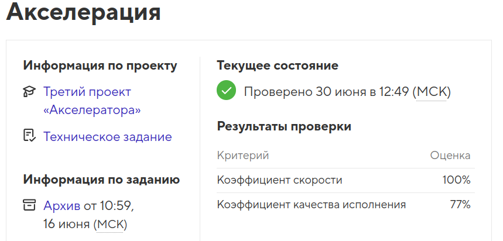

# Проект Intership

Проект выполнен в рамках финального этапа _"Акселератор"_ на профессиональном онлайн‑курсе «[Профессия «Фронтенд-разработчик»](https://htmlacademy.ru/profession/frontender/classic)» от [HTML Academy](https://htmlacademy.ru).

<h4>Проект создан в 2025 году</h4>

  

- Студент: [Виктория Калугина](https://up.htmlacademy.ru/javascript-individual/2/user/1788421).
- Проект: [Fitness](https://toryatoria.github.io/accelerator-project-3/)

Разработка велась полностью самостоятельно ( акселератор не подразумевает помощь наставников).  
Продолжительность проекта: 27 дней (20.05 - 16.06 2025 года).  
Цель задания - выполнить проект в установленный срок в соответствии с техническим заданием, требованиями по подготовке к защите и критериями качества.  

- [Критерии качества](https://htmlacademy.notion.site/4814c0ba58c240c4ad87ed2bacef2ff4)

- [Техническое задание](./readme/Readme_tz.md)

## Описание
**Intership** — это сайт для организации стажировок и обучения за рубежом.

## Технические требования

- **Адаптивность сетки:** отображено на макете. Контейнер фиксированной ширины.
- **Используемая методология:** БЭМ.
- **Используемые фреймворки:** нет.
- **Используемый препроцессор:** Sass (SCSS-синтаксис).
- **Используемый инструмент автоматизации:** поставляется в самом начале работы. Модификация сборки запрещена.
- **Кроссбраузерность:** Chrome, Firefox.
- **JavaScript:** необходимо реализовать компоненты с бургерным меню, формой, модальным окном и слайдерами.
- **Элементы помечены как контентная область в макете** — стилизуются по каскаду: добавлять атрибут class для контентных элементов, помеченных в макете красным, запрещено.

## Брейкопойнты:

- мобильная версия — 320px;
- планшетная версия — 768px;
- десктопная версия — от 1440px и выше.

## Общее

- Фоны, которые упираются в края макета, должны тянуться на всю страницу.
- Для реализации слайдеров используется библиотека `swiper.js`.

### Шапка

**Бургерное меню:**

- Работает одинаково на любом разрешении экрана.
- При открытии бургерного меню весь экран затемняется.
- Закрытие может происходить при взаимодействии с любой частью экрана, кроме навигации.
- Кнопка «Меню» имеет два состояния: покой и активное.
- Навигация имеет подкатегории.
- Все изменения состояний происходят плавно.

### Hero (Promo)

- Изображение занимает весь экран.

- **Блок с текстом:**
- Всегда находится снизу на одинаковом расстоянии.
- Блок должен быть готов к двойному переполнению текстами.

**Слайдер:**

- Зациклен (прокручивается бесконечно).
- Высота рассчитывается автоматически.
- На десктопной ширине отключена возможность перетаскивание слайдов мышкой.
- Буллеты являются интерактивными для переключения слайдов.

### О проекте

- Элемент «Подробнее о проекте» открывает модальное окно `«Напишите нам»`.

### Программы

**Слайдер:**

- Не имеет автозапуска.
- Не зациклен.
- Мобильная версия: показывается 1 слайд.
- Планшетная версия: показывается 2 слайда.
- Десктопная версия: показывается 3 слайда. Отключена возможность перетаскивание слайдов мышкой.
- Элементы со стрелками, начиная с планшета, «показать предыдущий слайд» и «показать следующий слайд» перелистывают по одной странице.
- Пагинация реализована в виде скролл-бара.

### Как поехать

- Количество пунктов в блоке «Чтобы получить грант…» может быть изменено.
- Изображение может быть любого размера.
- Изображение может быть изменено из административной части сайта.

### Новости и материалы

**Навигация:** - Элементы навигации — табы.

- Мобильная версия: имеет прокрутку для пунктов навигации, которые ушли за экран.
- Каждый пункт навигации интерактивный. Реализация переключения и смены контента не требуется.

**Слайдер:**

- Не имеет автозапуска.
- Не зациклен.
- На одной странице показывается несколько слайдов.
- Первый слайд на каждой странице всегда большой на десктопе.
- Элементы со стрелками «показать предыдущий» и «показать следующий» и пагинация перелистывают по одному элементу на всех разрешениях.
- Кнопки пагинации позволяют перейти к произвольному слайду.

**Поведение кнопок пагинации:**

- Если всего 4 слайда или меньше, отображаются кнопки для всех слайдов.
- Если больше 4 слайдов, отображаются первые 4 кнопки пагинации.
- При переходе на слайд 2 или 3, кнопки пагинации остаются неизменными, показывая кнопки слайдов 1, 2, 3, и 4.
- При переходе на слайд 4, кнопки пагинации смещаются: показываются кнопки слайдов 2, 3, 4, и 5.
- Для каждого последующего слайда до предпоследнего, кнопки пагинации продолжают смещаться, показывая текущий слайд, два предыдущих и один следующий слайд.
- Когда пользователь достигает последнего слайда, показываются последние 4 кнопки пагинации.

### Вопросы и ответы

- По умолчанию у аккордеона должен быть открыт третий ответ, как в макете.
- Одновременно могут быть открыты несколько ответов.
- Интерактивной частью блока является весь вопрос.

### Отзывы

- Слайдер: Не имеет автозапуска.
- Не зациклен.
- Элементы со стрелками «показать предыдущий слайд» и «показать следующий слайд» перелистывают по одному отзыву на всех разрешениях.

### Контакты

- Карта - статичная картинка.
- Телефон и email являются интерактивными элементами.

### Напишите нам

- Контент полей формы должен проходить валидацию.
- Инпуты не имеют подсказок к заполнению.
- Первая опция в поле «Выберите город» является пустой.
- Поле с телефоном должно иметь маску, начинающуюся с +7
- Поле «Ваше сообщение» может иметь любое количество введённого текста.
- Чекбокс «Я согласен...» - обязательныq для отправления формы. По умолчания галочка не проставлена.
- Текст сообщения ошибки выводится стандартными браузерными возможностями.
- Взаимодействие с кнопкой «Отправить» происходит со всей площадью.
- Отправка формы возможна только после заполнения всех полей.
- Пользователь должен увидеть результат отправки данных.

**Модальное окно «Напишите нам»:** имеет такие же требования как форма и закрывается по клику вне него.

### Подвал

- Логотип: никуда не ссылается.
- Ссылки в навигации являются якорными. При взаимодействии происходит перемещение к разделу сайта.
- Ссылки на социальные сети открываются на новой вкладке.
- Элемент «Политика конфиденциальности» переводит на другую страницу.
